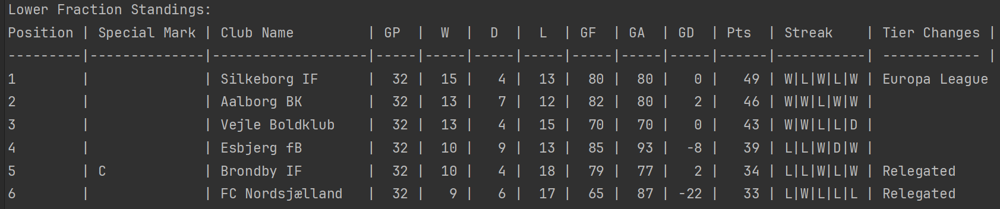

# Mandatory assignment: Football Standings

##  A C# program that outputs a table with football-league information based on csv files

This project takes different sorts of csv files to output information
about how a league is going.

This program requires:
* Multiple round files
* A setup file
* a teams file

## Usage and interprotation


The output above is an example of a league being processed and summarizes the standings of the league.

***Special Mark***:
* C for this leagues champion team
* W for the winner of last years league
* P for teams promotd from last season
* R for teams relegated from last season

***GP***: games played\
***W***: wins\
***D***: draws\
***L***: losses\
***GF***: goals for\
***GA***: goals against\
***GD***: goal difference\
***Pts***: points\
***Streak***: last 5 games*\
***Tier changes***: shows teams that have been promoted or relegated

## How to format information in your files

### Round files

#### Purpose
The program skims though 32 round files to get information about the matches

#### File Naming
Round files should be named like this: ***round-*** + ***[Round Number]*** + ***.csv***

Naming example:
```
round-4.csv
```


#### Content Formatting
First line is descriptive of how each subsequent line is read, and the program automatically skips the first line, so the ```home,home goals,away,away goals```  ***Must*** be included first

Formatting example:
```
home,home goals,away,away goals
FCK,4,BIF,0
BIF,0,AGF,3
AGF,1,HBK,1
HBK,4,VFF,3
VFF,1,AAB,4
AAB,1,SIF,1
```
> [!NOTE]
> The program is currently made to check though 32 rounds so make sure that you make use of 32 round files

### Setup file

#### Purpose
The setup file is used for information about the league itself

#### File Naming
The setup file should just be called setup.csv

Example:
```
setup.csv
```
#### Content Formatting
First line in the file is descriptive to help with knowing what each value stands for:\
```League name,Champions League,Conference League,Europa League,Relegation```\
The program actually starts reading data from line 2. It's organized like this:
```
Name of the league , Quantity of positions for Champions league promotion, Quantity of positions for Conference league promotion, e.t.c.
```

Setup File Example:
```
League name,Champions League,Conference League,Europa League,Relegation
SuperLigaen,1,2,1,2
```

### Teams File

#### Purpose
The Teams file container information about each individual team

#### File Naming
The teams file should just be called teams.csv

Example:
```
teams.csv
```

#### Content Formatting
First line is descriptive of how each subsequent line is read, and the program automatically skips the first line, so the ```Abbreviation,Full club name,Special ranking```  ***Must*** be included first

## Exceptions
We handle exceptions such that the user can see what went wrong and in what file. The primary exceptions are for invalid matchup given in the round files given the teams loaded.


